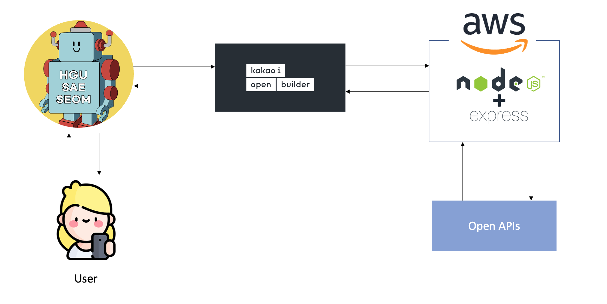

# 한동대학교를 섬기는 편리한 챗봇 '한동새섬봇'을 위한 API 서버

## Motivation

한동에서 생활하다보면 자주 반복되는 루틴이 있습니다. 이를테면, 아침엔 날씨확인, 점심저녁엔 식단표 확인, 그리고 등하교 시에는 버스 시간을 확인하죠. 앞서 나열한 일들을 처리하기 위해서는 학교의 인트라넷, 지도 어플, 날씨 어플을 번갈아 가며 열어 확인해야 합니다. 이런 번거로움 없이 원하는 정보를 한번에 볼 수는 없을까? 라는 생각에서 시작한 프로젝트입니다. 또한, 졸업 전에 나의 발자취가 남아있는 어플리케이션을 학교에 남기고 싶은 마음으로 챗봇을 개발하였습니다.

## Skill Stack

- NodeJS Express
- Kakao OpenBuilder
- AWS EC2

## Project Flow



## Project Structure

```
- log
- data
- src
    - api
        - bus.js
        - haksik.js
        - moms.js
        - weather.js
    - keys
        - apiKeys.js
    - models
        - resultData.js
    - services
        - busTracker.js
        - dailyHaksikDataGenerator.js
        - haksikResultTextGenerator.js
        - weatherTracker.js
    - server.js
```

- log : 매 시 정각마다 사용자들이 어떤 API를 호출했는지에 대한 횟수정보가 저장됩니다. log 아래에 yyyy-dd-mm 형태의 디렉토리가 생성되고 0시부터 1시까지 저장된 정보는 1.json, 1시부터 2시까지 저장된 정보는 2.json 과 같은 형태로 저장됩니다.
- data : 데이터베이스 대신 사용합니다. 현재는 당일의 학식 데이터인 `meal-hak.json` 와 맘스 키친 데이터인 `meal-moms.json` 이 저장됩니다.
- api : 각 요청의 Method 와 파라미터를 처리하는 과정을 정의합니다.
- keys : API 관련 키들을 저장합니다. 깃허브 저장소에는 푸쉬하지 않습니다.
- models : 데이터의 형식을 정의합니다.
- service : 비즈니스 로직을 담당하는 서비스들을 정의합니다.

## External APIs

이 서버는 외부 API를 통해 데이터를 수집하고 알맞은 텍스트로 가공해서 오픈빌더에 텍스트를 정송합니다. 사용된 외부 API들은 아래와 같습니다.

1. Handong Open API
2. [Open Weather API](https://openweathermap.org/api)
3. [국토부 버스도착정보 API](https://data.go.kr/data/15000757/openapi.do)
4. [굿바이 코로나 API](https://api.corona-19.kr/)
5. 대기환경공단 API

## Getting Started

- prerequisite: NodeJS stable version

1. 이 레파지토리를 클론합니다.
2. 패키지를 설치합니다.

   ```
   npm install
   ```

3. 서버를 실행합니다. 기본값으로 3000번 포트로 실행됩니다.

   ```
   node src/server.js
   ```

## API URL

카카오 오픈빌더는 POST 요청을 전송하므로 모든 METHOD는 `POST`로 정의합니다.

1. `/haksik` : 학생식당 식단 정보
2. `/moms` : 맘스키친 식단 정보
3. `/bus/toHandong` : 한동대학교행 302번 버스 양덕 농협 정류장 도착 정보
4. `/bus/toYangdeok` : 양덕행 302번 버스 한동대학교 정류장 도착 정보
5. `/weather` : 현재 날씨 정보
6. `/covid` : 금일 시도별 신규 확진자 현황
